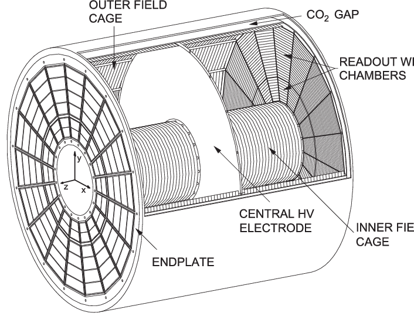

# TPC distorsion calibration with Deep Networks



## Overview of the software:
This software is meant at providing a fast way for performing space-charge (SC) distorsion corrections using deep networks. In particular, the current version uses UNet to train an input dataset made of SC densities and fluctuations and try to predict distorsions along the R, phi and z axis. 

Authors: M. Ivanov (marian.ivanov@cern.ch), G.M. Innocenti (ginnocen@cern.ch), Rifki Sadikin (rifki.sadikin@cern.ch), D. Sekihata (daiki.sekihata@cern.ch)

The original version of the code was developed by M. Ivanov and R. Sadikin and can be found here https://gitlab.cern.ch/alice-tpc-offline/alice-tpc-notes/-/tree/master/JIRA%2FATO-439%2Fcode%2Fpython

Please find detailed instruction about the analysis and the software package here https://github.com/AliceO2Group/TPCwithDNN/wiki

## Installation and setup

### Obtaining the package, virtual environment

**NOTE:** This software has only been tested on the ALICE ML machine for the moment. It might run in other environments but the setup does only explain how to use it on this particular machine.

Change to a directory where you want to place the `TPCwithDNN` package. In there, type

```bash
git clone https://github.com/AliceO2Group/TPCwithDNN.git
```

and you will find a new directory `TPCwithDNN`.

To keep the `python` environmnet clean, we will use a virtual environment for the software setup. Dealing with that is handled by `TPCwithDNN/load.sh` and there are 3 scenarios when you type

```bash
source load.sh # This you can actually source from anywhere
```

1. If the environment has not been created yet, sourcing will create and enter it.
2. Being inside the environment, sourcing it again will leave the environment.
3. Outside of the environment, `source load.sh --recreate` will delete and re-install it.

### Installation

From inside the virtual environment, change to `$CLONE_TOP_DIR/TPCwithDNN` where you can find `setup.py`. To install the package with all its dependencies, run

```bash
pip install -e .
```

Now, you are good to go and you can run the code!
